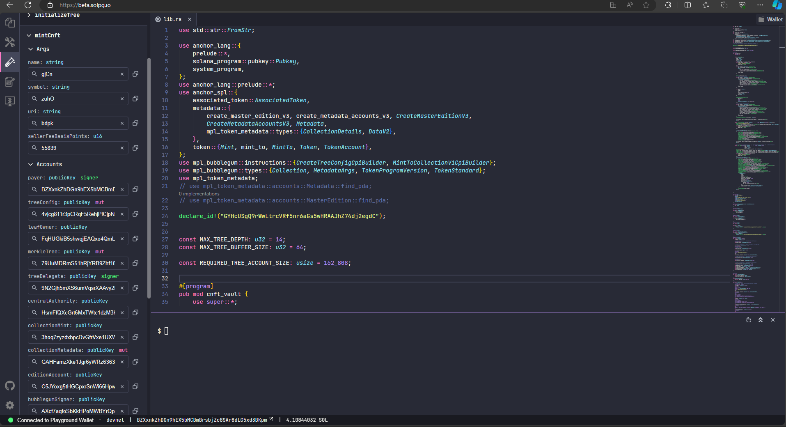
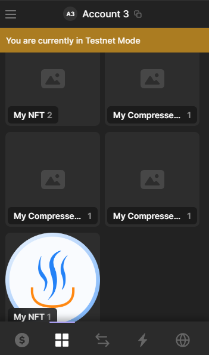
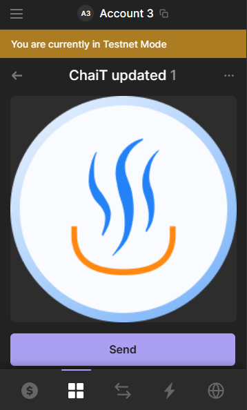

# CNFT mint implementation in typescript and rust

## typescript implementation

### Setup

1. ```npm install``` and install solana cli. Create new wallet using keygen and add funds to it using solana airdrop.
2. Create collection NFT by running```node mint.js```
3. Mint to collection
     - Copy mint address from the log of mint js and update `mint` constant
     - update the leaf owner to the addres you want the token to be minted to 
     - ```node createCollection.js```

Check your Solana phantom wallet for the leaf owner address and NFT is minted

However the minted NFTs cannot be seen on explorer and should use metaplex api to fetch the data using `findLeafAssetIdPda` (Done after minting to collection in the script) and should be used to retrieve metadata.

However we can prove the asset ownership and leaf ownership onchain but still have to use their api.

## Rust implementation 

### Setup 

1. Install Anchor and initialize a project
    - copy given code to the lib.rs file
    - `anchor build`
    - `anchor deploy`
2. Otherwise copy to solana playground and deploy 
    - Deploy to devnet
    - Go to test and enter the address of mint and merkel tree we derived from minting in typescript 
    

3. Call mintCnft function.

## Results 
### Smart Contract

Find the CFT minting program in devnet here
https://explorer.solana.com/tx/5hp85mdwYgyGQJKmmKszU1gk55xf5xaY63tHLhKVZniuoF3ceFYgbodsy9GZu7nCnETdsiox3WAaASkNdvfpfCW3?cluster=devnet

Cnfts Minted and visible in wallet


### Collection
 
### CNFT
